# Proyecto: API de Consultas y Registros de Datos Bancarios

## Equipo de Trabajo: DevFinTech

### Integrantes:

- Samuel Felipe Chambi Ytusaca
- Ancel Alain Cruz Chaiña
- Julio Yauri Ituccayasi
- Juan Manuel Soto Begazo

## Cliente: FinBank Solutions

## Propósito del Proyecto

Este proyecto tiene como objetivo desarrollar una API robusta y segura para la consulta y registro de datos bancarios. La API permitirá a los usuarios realizar diversas operaciones bancarias, incluyendo la consulta de saldos, registros de transacciones, y otros servicios relacionados con la gestión de cuentas bancarias. Nuestro propósito es proporcionar una herramienta eficiente y confiable para mejorar la experiencia del usuario y optimizar las operaciones bancarias.

## Características Principales

- **Consulta de Saldo:** Permite a los usuarios consultar el saldo de sus cuentas bancarias de manera rápida y segura.
- **Registro de Transacciones:** Facilita el registro de transacciones bancarias, asegurando la integridad y precisión de los datos.
- **Gestión de Cuentas:** Ofrece herramientas para la gestión eficiente de cuentas bancarias, incluyendo la creación, actualización y eliminación de cuentas.

## Principios SOLID

- **Principio de responsabilidad única:**
  Las clases implementadas solo realizan un tipo de tarea. Como ejemplo tenemos a las clases [factory](./bank_api/credit-microservice/src/main/java/com/microservice/credit/factory/). Ejemplo: La clase *SignatoryFactory* se encarga únicamente de crear instancias *Signatory*.

  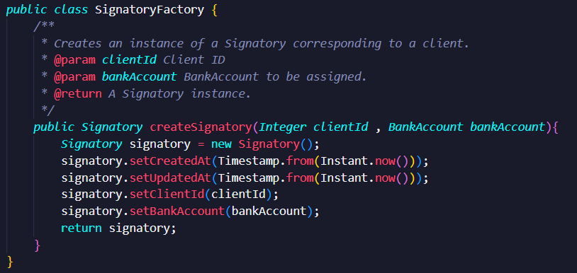

- **Principio de abierto/cerrado:**
  Este principio fue aplicado principalmente en los controladores. Por ejemplo, los métodos de la clase *BankAccountLogController* no deberían ser modificados, pero es posible que se agreguen algunos métodos en el futuro.

  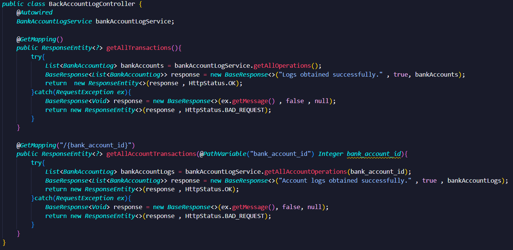

<!-- - **Principio de sustitución de Liskov** -->
- **Principio de segregación de la interfaz:**
  Todas las clases que heredan de *JpaRepository*, utilizan sus funciones en algún momento. Ejemplo (clase *BankAccountLogRepository*), los métodos de *JpaRepository* se utilizan desde otras clases, como *BankAccountLogService*:

  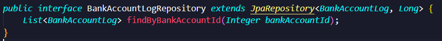
  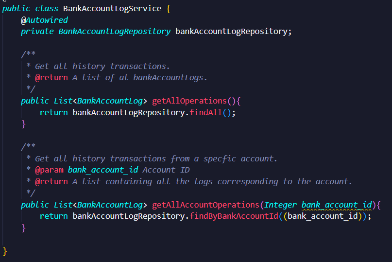

<!-- - **Principio de inversión de dependencias** -->

## Domain-Driven Design

- **Entidades y objetos de valor:**
  Las entidades principales se encuentran en el microservicio *credit*. Además, cada entidad tiene un ID y algunos objetos de valor (número de tarjeta, ID del cliente, etc):

  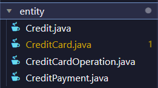

  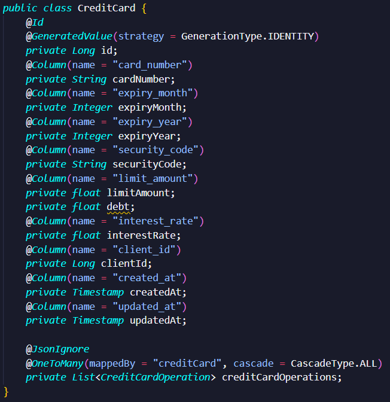

- **Agregados:**
  La clase *BankAccount* contiene listas (sets) de titulares (holders) y signatarios.

  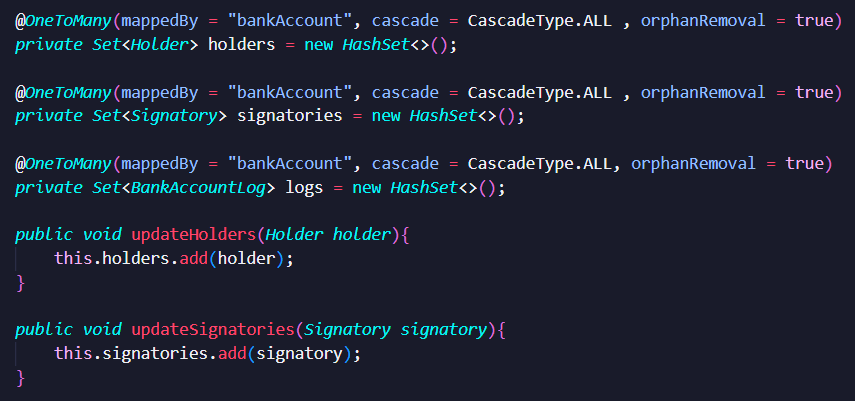

- **Fábricas y módulos:**
  Los objetos fábrica se encargan únicamente de la creación de instancias de algún módulo o agregado.

  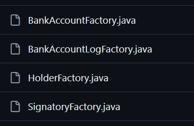

  
  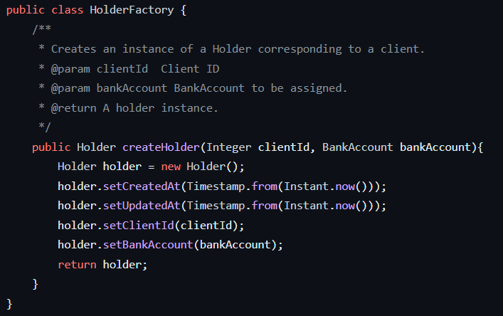

- **Repositorios y servicios:**
  Se implementaron múltiples capas que funcionan como repositorios y servicios (una capa por cada microservicio). Ejemplo (microservicio *bank-accounts*):

  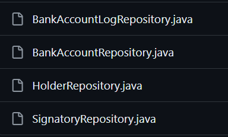
  

## Patrones de arquitectura

El proyecto siguió una arquitectura basada en microservicios. A continuación se describe la estructura de los microservicios implementados. 
- bank-accounts-microservice

  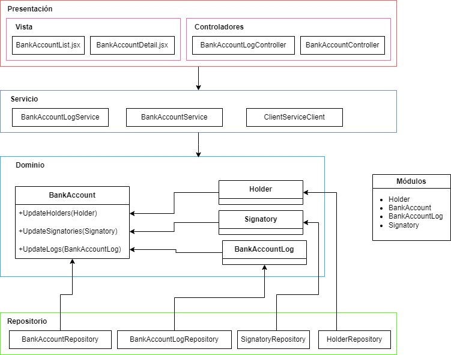}

- client-microservice

  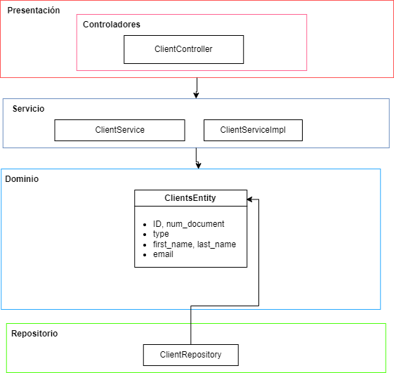

- credit-microservice

  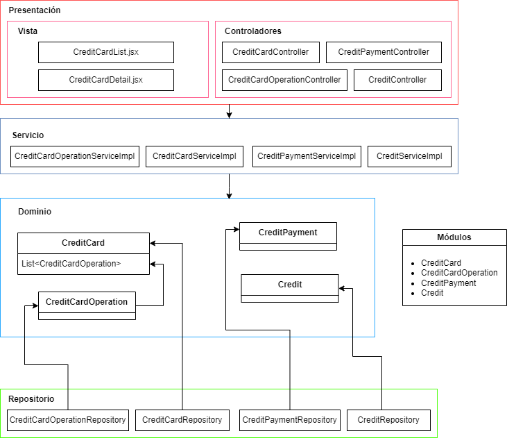

  Adicionalmente se utilizaron los microservicios *gateway* y *Eureka*. *Gateway* funciona como un punto de comunicación entre el cliente y los microservicios. *Eureka* facilita la comunicación entre los microservicios registrados. 

## Pruebas de API 

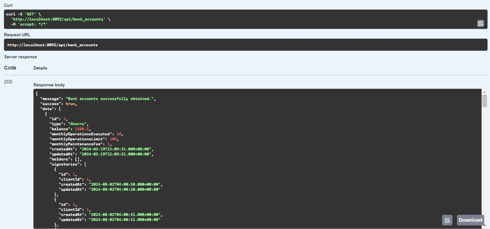

<!-- ## Pruebas de rendimiento  -->

## Pruebas de seguridad

Las pruebas de seguridad se realizaron con OWASP ZAP. 

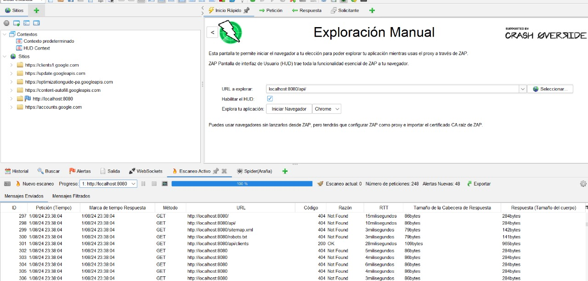

Los mensajes enviados por OWASP ZAP se pueden encontrar en [Registros](./assets/owasp/Registro.csv)
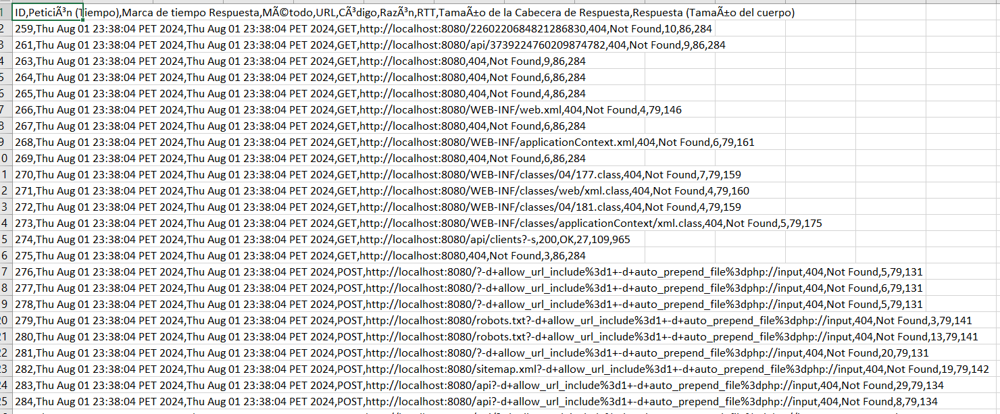

## Documentación de servicios con Swagger

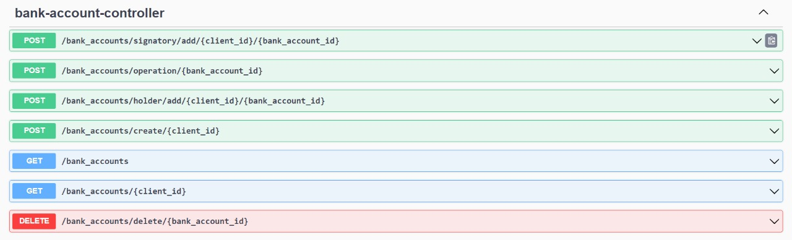
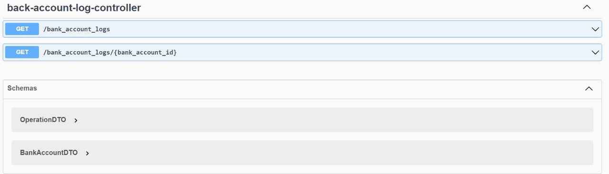

# Módulos y Sprints

### Módulo de Autenticación y Autorización

Responsable de centralizar la lógica para manejar el acceso no autorizado en todas las APIs.

### Módulo de Gestión de Tarjetas de Crédito

- **Sprint 1:** Implementar la funcionalidad para obtener todas las tarjetas de crédito registradas en el sistema.
- **Sprint 2:** Desarrollar la funcionalidad para consultar los detalles de una tarjeta de crédito específica por su ID.
- **Sprint 3:** Implementar la funcionalidad para obtener todas las tarjetas de crédito asociadas a un cliente específico.
- **Sprint 4:** Desarrollar la funcionalidad para crear nuevas tarjetas de crédito.

### Módulo de Operaciones de Tarjetas de Crédito

- **Sprint 5:** Implementar la funcionalidad para realizar pagos de deudas de tarjetas de crédito.
- **Sprint 6:** Desarrollar la funcionalidad para cargar montos a tarjetas de crédito.
- **Sprint 7:** Implementar la funcionalidad para consultar el monto disponible en una tarjeta de crédito.

### Módulo de Gestión de Créditos

- **Sprint 8:** Desarrollar la funcionalidad para obtener todos los créditos registrados en el sistema.
- **Sprint 9:** Implementar la funcionalidad para consultar los detalles de un crédito específico por su ID.
- **Sprint 10:** Desarrollar la funcionalidad para obtener todos los créditos asociados a un cliente específico.
- **Sprint 11:** Implementar la funcionalidad para crear nuevos créditos.

### Módulo de Operaciones de Crédito

- **Sprint 12:** Desarrollar la funcionalidad para realizar pagos de deudas de créditos.

# Seguimiento a Cambios: GitHub Issues

### Backlog

Tareas identificadas pero aún no iniciadas. Ejemplos de estas tareas son:

- Gestión de accesos no autorizados.
- Gestión de deudas relacionadas con el envío de datos no válidos o incorrectos.

### Ready

Tareas que están preparadas para comenzar. Estas tareas incluyen:

- Manejo de cantidades con datos no válidos.
- Gestión de problemas de acceso no autorizado.

### In Progress

Tareas en las que se está trabajando activamente. Ejemplos de estas tareas son:

- Cargar importes en una tarjeta de crédito.
- Saldar deudas con datos no válidos.

### Test

Tareas en la fase de pruebas. Estas tareas incluyen:

- Verificación de la creación de nuevas tarjetas de crédito.
- Manejo de diversos escenarios de autorización.

### Done

Tareas que se han completado. Estas incluyen:

- Recuperación satisfactoria de información de tarjetas de crédito.
- Gestión de tarjetas de crédito específicas o inexistentes.
- Gestión de listas vacías.

## Board

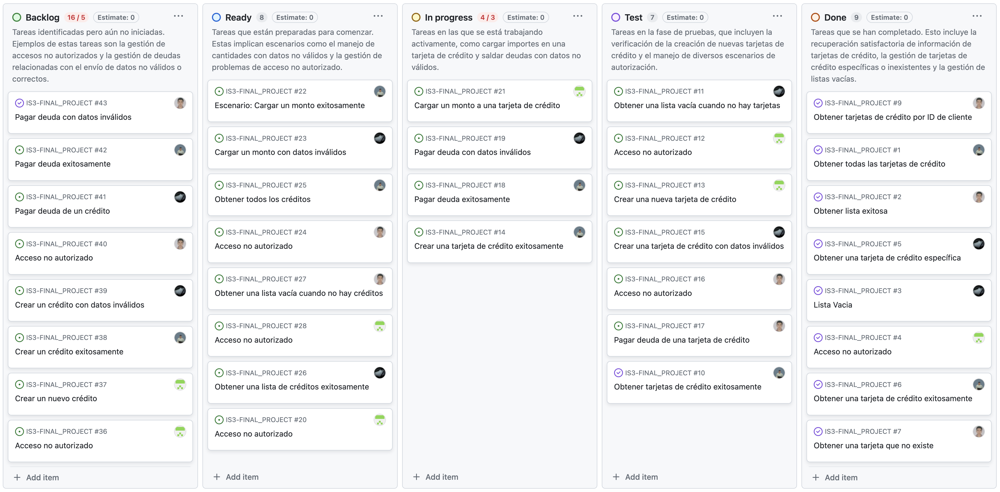

## RoadMap

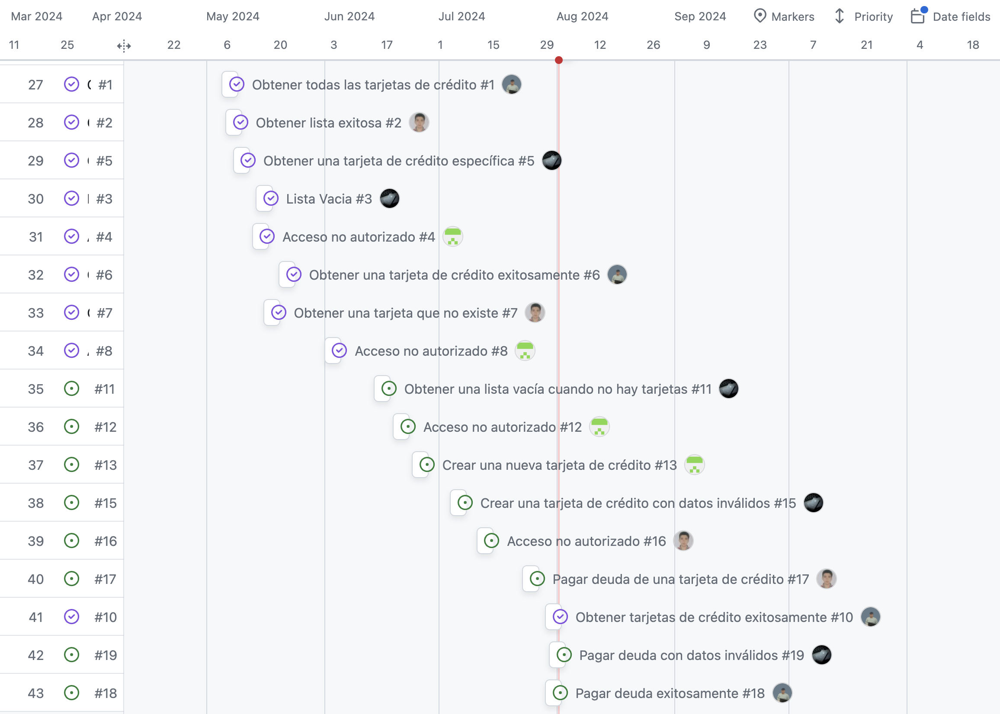

## Tecnologías Utilizadas

- **Backend:** Spring Boot
- **Base de Datos:** PostgreSQL
- **Documentación:** Swagger

## Uso de la API

Para más detalles sobre el uso de la API, consulta la documentación completa disponible en Swagger.

## Contribuciones

Las contribuciones son bienvenidas. Por favor, abre un issue o un pull request para sugerencias y mejoras.

## Licencia

Este proyecto está licenciado bajo la Licencia MIT. Consulta el archivo LICENSE para más detalles.
