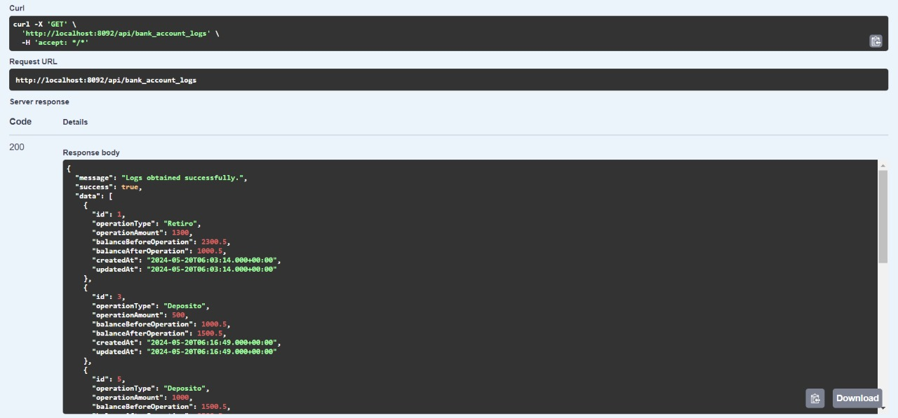

# Proyecto: API de Consultas y Registros de Datos Bancarios

## Equipo de Trabajo: DevFinTech

### Integrantes:
- Samuel Felipe Chambi Ytusaca
- Ancel Alain Cruz Chaiña 
- Julio Yauri Ituccayasi
- Juan Manuel Soto Begazo

## Cliente: FinBank Solutions

## Propósito del Proyecto

Este proyecto tiene como objetivo desarrollar una API robusta y segura para la consulta y registro de datos bancarios. La API permitirá a los usuarios realizar diversas operaciones bancarias, incluyendo la consulta de saldos, registros de transacciones, y otros servicios relacionados con la gestión de cuentas bancarias. Nuestro propósito es proporcionar una herramienta eficiente y confiable para mejorar la experiencia del usuario y optimizar las operaciones bancarias.

## Características Principales

- **Consulta de Saldo:** Permite a los usuarios consultar el saldo de sus cuentas bancarias de manera rápida y segura.
- **Registro de Transacciones:** Facilita el registro de transacciones bancarias, asegurando la integridad y precisión de los datos.
- **Gestión de Cuentas:** Ofrece herramientas para la gestión eficiente de cuentas bancarias, incluyendo la creación, actualización y eliminación de cuentas.

## Tecnologías Utilizadas

- **Backend:** Spring Boot
- **Base de Datos:** MySQL
- **Documentación:** Swagger

## Principios SOLID

- **Principio de responsabilidad única**
  Las clases implementadas solo realizan un tipo de tarea. Como ejemplo tenemos a las clases [factory](./bank_api/credit-microservice/src/main/java/com/microservice/credit/factory/). Ejemplo: La clase *SignatoryFactory* se encarga únicamente de crear instancias *Signatory*.

  

- **Principio de abierto/cerrado**
  Este principio fue aplicado principalmente en los controladores. Por ejemplo, los métodos de la clase *BankAccountLogController* no deberían ser modificados, pero es posible que se agreguen algunos métodos en el futuro.

  

<!-- - **Principio de sustitución de Liskov** -->
- **Principio de segregación de la interfaz**
  Todas las clases que heredan de *JpaRepository*, utilizan sus funciones en algún momento. Ejemplo (clase *BankAccountLogRepository*), los métodos de *JpaRepository* se utilizan desde otras clases, como *BankAccountLogService*:

  
  

<!-- - **Principio de inversión de dependencias** -->

## Domain-Driven Design

- **Entidades y objetos de valor**
  Las entidades principales se encuentran en el microservicio *credit*. Además, cada entidad tiene un ID y algunos objetos de valor (número de tarjeta, ID del cliente, etc):

  
  

- **Agregados**
  La clase *BankAccount* contiene listas (sets) de titulares (holders) y signatarios.

  

- **Fábricas y módulos**
  Los objetos fábrica se encargan únicamente de la creación de instancias de algún módulo o agregado.

  
  

- **Repositorios y servicios**
  Se implementaron múltiples capas que funcionan como repositorios y servicios (una capa por cada microservicio). Ejemplo (microservicio *bank-accounts*):

  
  

## Patrones de arquitectura

El proyecto siguió una arquitectura basada en microservicios. A continuación se describe la estructura de los microservicios implementados. 
- bank-accounts-microservice
  }

- client-microservice
  

- credit-microservice
  

  Adicionalmente se utilizaron los microservicios *gateway* y *Eureka*. *Gateway* funciona como un punto de comunicación entre el cliente y los microservicios. *Eureka* facilita la comunicación entre los microservicios registrados. 

## Pruebas de API 

<!-- ## Pruebas de rendimiento  -->

## Pruebas de seguridad

Las pruebas de seguridad se realizaron con OWASP ZAP. 

Los mensajes enviados por OWASP ZAP se pueden encontrar en [Registros](./assets/owasp/Registro.csv)

## Documentación de servicios con Swagger

## Licencia

Este proyecto está licenciado bajo la Licencia MIT. Consulta el archivo LICENSE para más detalles.
